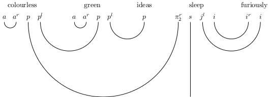

Moroz's parsing algorithm
==========================

Implementation in Java, under GPLv3.

This algorithm is a parser for pregroup grammars.
The program checks the validity of a sentence for a given grammar. If it is valid,
it generates a diagram picturing the proof, which is a type reduction.
The diagram is generated in TikZ.

Example output :
---------------

Input grammar :
----------------

This software uses the Stanford POS tagger to infer the type of words in sentences.
Then, it uses a handmade mapping from Penn Treebank tags to pregroup types. This
mapping is specified in an XML file.

